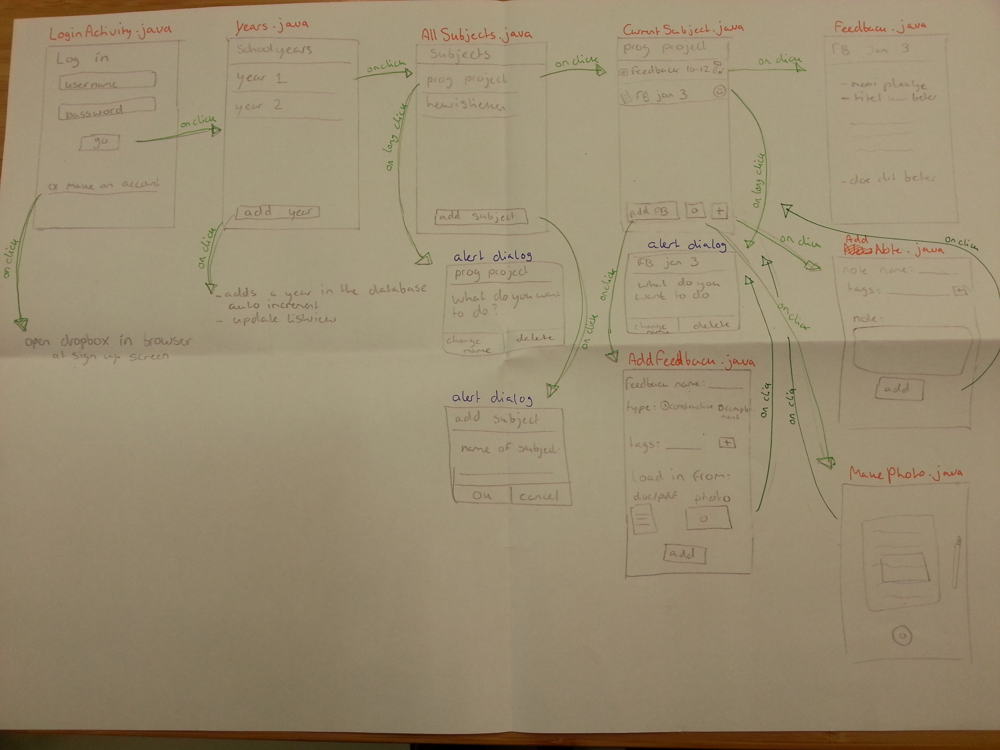
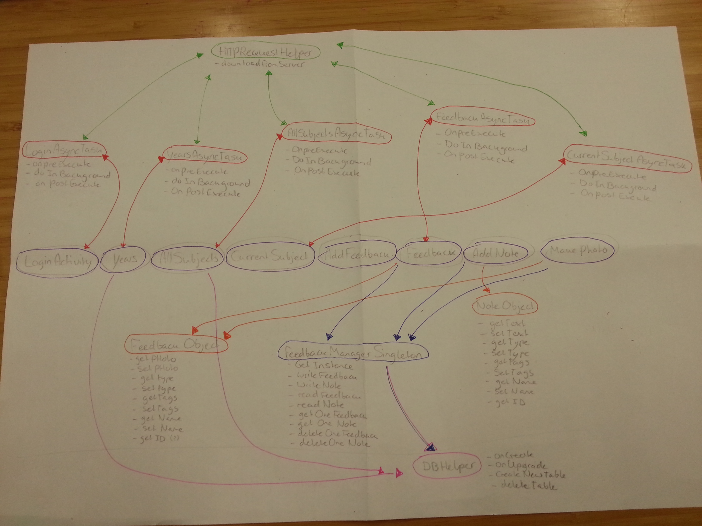

# Design Document

##### User Interface Map

The user interface will look like this:

I might change the doc/pdf file option, since showing those datatypes will need another API. I will for now focus on photos and memos.
Later on I might implement a voicerecord feature.

##### UML sketch

I'll be using the Dropbox API to save the data to. Every file will be uploaded and read from dropbox. I will also need a table to store tags in.
This means I will have a SQLite database, which stores the users tags for each filename.
(I might later on start using the FireBase API as a database instead of the Dropbox API + SQL Database, I'm looking into that)

This is what the UML will look like:

The top of the UML has all the classes that have to do with the Dropbox API. The classes in the middle are activities and the classes at the bottom of the UML have to do with the SQLite Database.
