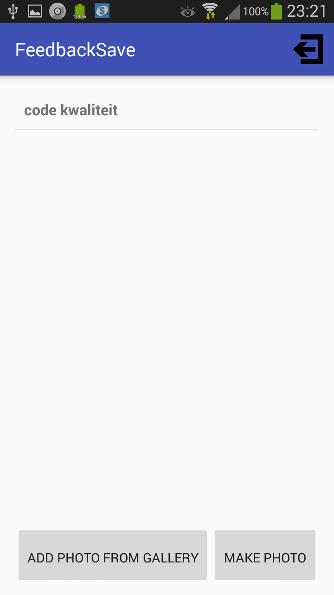
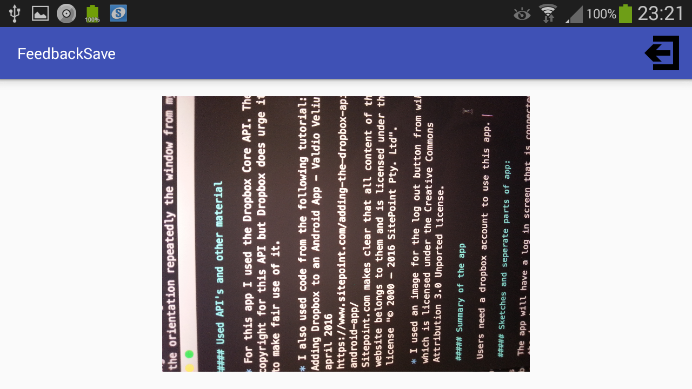

# Programmeer Project Proposal

######FeedbackSave - made by Caitlin Schäffers
######Licensed to Caitlin Schäffers under the MIT License. See the LICENSE file in the project root for more information.

This project is a feedback app on which users can save the feedback they received on subjects throughout the years. 

##### Used API's and other material

* For this app I used the Dropbox Core API. There's no copyright for this API but Dropbox does urge its users to make fair use of it. 

* I also used code from the following tutorial:  
Adding Dropbox to an Android App - Valdio Veliu, 19 april 2016
https://www.sitepoint.com/adding-the-dropbox-api-to-an-android-app/  
Sitepoint.com makes clear that all content of the website belongs to them and is licensed under their own license "© 2000 – 2016 SitePoint Pty. Ltd". 

* I used an image for the log out button from wikimedia which is licensed under the Creative Commons Attribution 3.0 Unported license.

##### Summary of the app

Users need a dropbox account to use this app. 

The first screen they'll see is the YearsActivity in which they can add and delete years. Upon clicking on a year they go to the AllSubjectActivity where all the subjects they've added to that year are visible. These subjects can be added, deleted and changed by name. Upon clicking on a subject the user goes to the CurrentSubjectActivity where all the feedback added to that subject is listed. Feedback can be added, deleted and changed by name. In this activity the user can choose to upload feedback by choosing a picture from the gallery of their phone or by making a picture. In both cases the picture that's being taken gets uploaded to dropbox. When the user clicks on the feedback the PhotoFeedbackActivity will open and download the feedback image from dropbox and show the image in the imageview. The user is able to logout from every activity in the app.

Example of the app:

Downloaded feedback (in landscape mode):

